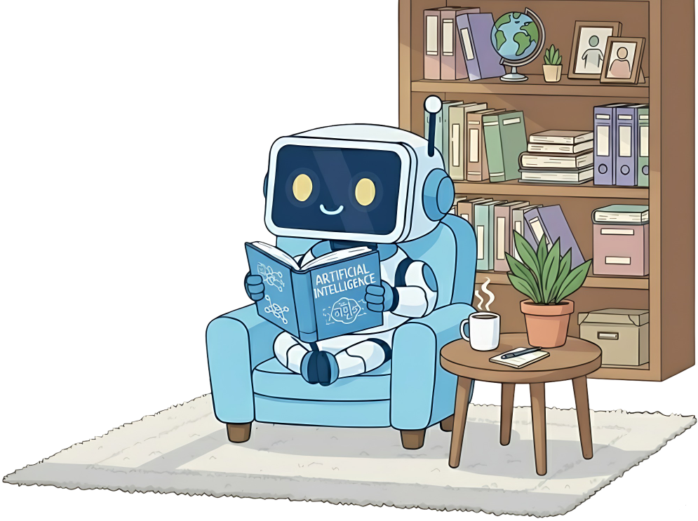
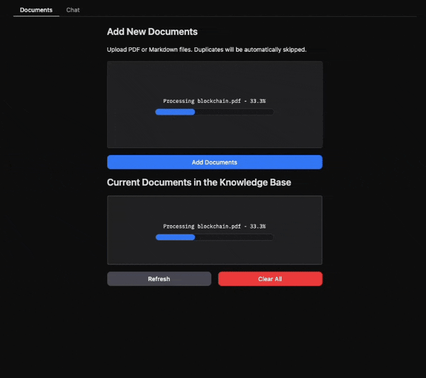

<p align="center">
  
</p>

<h1 align="center">🌌 AURA RAG — Agentic Universal Retrieval Assistant</h1>

<p align="center">
  <strong>A production-ready Agentic RAG system with intelligent web scraping, multi-format document ingestion, MongoDB authentication, and a premium Gradio interface — built with LangGraph.</strong>
</p>

<p align="center">
  <a href="#-features">Features</a> •
  <a href="#-architecture">Architecture</a> •
  <a href="#-tech-stack">Tech Stack</a> •
  <a href="#-getting-started">Getting Started</a> •
  <a href="#-usage">Usage</a> •
  <a href="#-project-structure">Project Structure</a> •
  <a href="#-contributing">Contributing</a> •
  <a href="#-contact">Contact</a>
</p>

<p align="center">
  
  
  
  
  
  
  
</p>

<p align="center">
  
</p>

---

## 📌 Overview

**AURA RAG** is a full-stack Agentic Retrieval-Augmented Generation system that goes beyond basic document Q&A. It combines intelligent web scraping, multi-format document processing, a production-grade auth system, and a premium dark-mode UI into a single, deployable application.

Unlike typical RAG tutorials, AURA RAG is built to handle **real-world scenarios** — scraping live websites, processing diverse file formats, maintaining per-user chat history, and delivering answers through a multi-agent orchestration pipeline that self-corrects and compresses context automatically.

---

## ✨ Features

### 🔍 Intelligent Document Ingestion
| Capability | Description |
|---|---|
| 📄 **Multi-Format Support** | Upload and process **PDF**, **DOCX**, **CSV**, **TXT**, and **Markdown** files seamlessly |
| 🌐 **Universal Web Scraper** | Scrape any public URL — websites, GitHub repos, documentation pages, blogs — and convert content to searchable markdown |
| 🐙 **GitHub Integration** | Fetch repository README files and contribution statistics directly from any public GitHub repo |
| ⚡ **Auto-Conversion Pipeline** | All documents are automatically converted to markdown, chunked hierarchically, and indexed into the vector database |

### 🧠 Advanced RAG Pipeline
| Capability | Description |
|---|---|
| 🗂️ **Hierarchical Indexing** | Parent/child chunk strategy — search small chunks for precision, retrieve large parent chunks for full context |
| 🔀 **Multi-Agent Map-Reduce** | Complex queries are decomposed into parallel sub-queries, each handled by an independent agent |
| ✅ **Self-Correction** | Agents automatically rephrase and re-query when initial results are insufficient |
| 🗜️ **Context Compression** | Token-aware compression keeps working memory lean across long retrieval loops |
| ❓ **Query Clarification** | Ambiguous queries are rewritten or paused for user clarification before retrieval |
| 💬 **Conversation Memory** | Maintains context across questions for natural, multi-turn dialogue |
| 🔎 **Hybrid Search** | Dense (semantic) + Sparse (BM25) retrieval via Qdrant for maximum recall and precision |

### 🔐 Authentication & User Management
| Capability | Description |
|---|---|
| 🔑 **MongoDB Atlas Auth** | Secure user registration and login with **bcrypt** password hashing |
| 📜 **Per-User Chat History** | Every user's queries and AI responses are stored and retrievable from a dedicated history panel |
| 🗂️ **Session Management** | Create, switch between, and delete chat sessions — each with its own conversation thread |
| 🔒 **Singleton DB Manager** | Thread-safe MongoDB connection management with automatic reconnection |

### 🎨 Premium UI/UX
| Capability | Description |
|---|---|
| 🌑 **Obsidian Dark Theme** | A sleek, dark-mode interface with glassmorphism effects, gradient accents, and smooth animations |
| 📁 **Document Viewer Panel** | Toggle a right-side panel to view all uploaded documents at a glance |
| 📋 **History Panel** | Toggle a right-side panel to browse, load, or delete past chat sessions |
| ⚡ **Real-time Processing** | Live progress indicators during document upload and RAG pipeline execution |
| 📱 **Responsive Layout** | Fully responsive design that works across desktop and tablet screens |

### 🔭 Observability & Monitoring
| Capability | Description |
|---|---|
| 📊 **Langfuse Integration** | Optional LLM call tracing, tool usage tracking, and graph execution monitoring |
| 🪵 **Structured Logging** | Detailed server-side logs for debugging and performance analysis |

---

## 🏗️ Architecture

```
┌──────────────────────────────────────────────────────────────────┐
│                         AURA RAG System                          │
├──────────────────────────────────────────────────────────────────┤
│                                                                  │
│  ┌─────────────┐    ┌──────────────────┐    ┌────────────────┐  │
│  │   Gradio UI  │───▶│  Authentication  │───▶│  MongoDB Atlas │  │
│  │  (Premium    │    │  (bcrypt/login)  │    │  (Users/Chat   │  │
│  │   Dark Mode) │    └──────────────────┘    │   History)     │  │
│  └──────┬──────┘                             └────────────────┘  │
│         │                                                        │
│         ▼                                                        │
│  ┌──────────────┐    ┌──────────────────┐                       │
│  │  Document     │───▶│  Web Scraper     │                       │
│  │  Manager      │    │  (URL/GitHub/    │                       │
│  │  (Multi-fmt)  │    │   Any Website)   │                       │
│  └──────┬───────┘    └──────────────────┘                       │
│         │                                                        │
│         ▼                                                        │
│  ┌──────────────┐    ┌──────────────────┐    ┌────────────────┐ │
│  │  Hierarchical │───▶│  Qdrant Vector   │◀──│  Hybrid Search │ │
│  │  Chunker      │    │  Database         │    │  Dense + BM25  │ │
│  └──────────────┘    └──────────────────┘    └────────┬───────┘ │
│                                                       │         │
│         ┌─────────────────────────────────────────────┘         │
│         ▼                                                        │
│  ┌──────────────────────────────────────────────────────────┐   │
│  │                  LangGraph Agent Pipeline                 │   │
│  │                                                          │   │
│  │  Query ─▶ Summarize ─▶ Rewrite ─▶ Clarify              │   │
│  │    │                                  │                   │   │
│  │    ▼                                  ▼                   │   │
│  │  ┌──────────┐  ┌──────────┐  ┌──────────┐              │   │
│  │  │ Agent #1 │  │ Agent #2 │  │ Agent #N │  (Parallel)  │   │
│  │  │ Search → │  │ Search → │  │ Search → │              │   │
│  │  │ Retrieve │  │ Retrieve │  │ Retrieve │              │   │
│  │  │ Compress │  │ Compress │  │ Compress │              │   │
│  │  └────┬─────┘  └────┬─────┘  └────┬─────┘              │   │
│  │       └──────────────┼──────────────┘                    │   │
│  │                      ▼                                    │   │
│  │              Aggregate & Respond                          │   │
│  └──────────────────────────────────────────────────────────┘   │
│                                                                  │
└──────────────────────────────────────────────────────────────────┘
```

### Query Processing Pipeline

1. **Conversation Summary** — Analyzes recent chat history for context continuity
2. **Query Rewriting** — Resolves references, fixes grammar, splits multi-part queries
3. **Query Clarification** — Detects unclear input and pauses for human clarification
4. **Parallel Agent Retrieval** — Spawns independent agents per sub-query for concurrent search
5. **Self-Correction Loop** — Each agent rephrases failed queries and retries automatically
6. **Context Compression** — Token-aware compression prevents context overflow
7. **Response Aggregation** — Merges all agent findings into a single, coherent answer

---

## 🛠️ Tech Stack

| Layer | Technology |
|---|---|
| **LLM** | Google Gemini 2.5 Flash (default), OpenAI, Anthropic, Ollama |
| **Orchestration** | LangGraph 1.2+ |
| **Vector Database** | Qdrant (Local) with Hybrid Search (Dense + BM25) |
| **Embeddings** | sentence-transformers/all-mpnet-base-v2 (Dense), Qdrant/bm25 (Sparse) |
| **Authentication** | MongoDB Atlas + bcrypt |
| **Frontend** | Gradio 6.14 with custom CSS |
| **PDF Processing** | PyMuPDF4LLM |
| **Web Scraping** | BeautifulSoup4 + Requests |
| **Observability** | Langfuse (optional) |
| **Containerization** | Docker |

---

## 🚀 Getting Started

### Prerequisites

- **Python 3.11+**
- **MongoDB Atlas** account (free tier works) — for auth & chat history
- **API Key** for at least one LLM provider (Gemini, OpenAI, Anthropic, or local Ollama)

### Installation

1. **Clone the repository**

```bash
git clone https://github.com/NadeemAhmad3/Aura_RAG.git
cd Aura_RAG
```

2. **Create and activate a virtual environment**

```bash
python -m venv .venv

# Windows
.venv\Scripts\activate

# macOS/Linux
source .venv/bin/activate
```

3. **Install dependencies**

```bash
pip install -r requirements.txt
```

4. **Configure environment variables**

```bash
cp project/.env.example project/.env
```

Edit `project/.env` and fill in your credentials:

```env
# LLM Provider (at least one required)
GEMINI_API_KEY=your-gemini-api-key

# MongoDB Atlas (for auth & history)
MONGODB_URI=mongodb+srv://<username>:<password>@<cluster>.mongodb.net/AURA_RAG?retryWrites=true&w=majority

# Optional: Langfuse Observability
LANGFUSE_ENABLED=false
LANGFUSE_PUBLIC_KEY=
LANGFUSE_SECRET_KEY=
LANGFUSE_BASE_URL=http://localhost:3000
```

5. **Run the application**

```bash
cd project
python app.py
```

The app will launch at `http://localhost:7860` 🚀

### Docker Deployment

```bash
docker build -t aura-rag -f project/Dockerfile .
docker run -p 7860:7860 --env-file project/.env aura-rag
```

---

## 📖 Usage

### 1. Authentication
On first visit, you'll see the login screen. **Register** a new account or **login** with existing credentials. All your chat history will be tied to your account.

### 2. Upload Documents
Use the upload panel to drag & drop files. Supported formats:
- 📄 **PDF** — Converted to markdown via PyMuPDF4LLM
- 📝 **DOCX** — Converted using python-docx
- 📊 **CSV** — Parsed into structured markdown tables
- 📋 **TXT** — Direct text ingestion
- 📑 **Markdown** — Indexed as-is

### 3. Scrape Web Content
Paste any URL into the URL input field:
- **Any website** — Extracts main content via BeautifulSoup
- **GitHub repos** — Fetches README and contribution data
- **Documentation pages** — Strips nav/footer, keeps core content

### 4. Ask Questions
Type your questions in the chat interface. The multi-agent pipeline will:
- Analyze your query for clarity
- Search the vector database using hybrid retrieval
- Self-correct if initial results are poor
- Deliver a comprehensive, source-cited answer

### 5. Browse History
Click the **History** toggle in the header to view, load, or delete past chat sessions.

### 6. View Documents
Click the **Documents** toggle to see all indexed documents at a glance.

---

## 📂 Project Structure

```
agentic-rag-for-dummies/
├── assets/
│   ├── logo.png                    # AURA RAG logo
│   ├── demo.gif                    # Demo animation
│   └── agentic_rag_workflow.png    # Architecture diagram
├── project/
│   ├── app.py                      # Application entry point
│   ├── config.py                   # Centralized configuration
│   ├── utils.py                    # Document converters & web scraper
│   ├── document_chunker.py         # Hierarchical chunking engine
│   ├── Dockerfile                  # Container deployment
│   ├── core/
│   │   ├── chat_interface.py       # Chat session management
│   │   ├── document_manager.py     # Multi-format document pipeline
│   │   ├── observability.py        # Langfuse integration
│   │   └── rag_system.py           # RAG system orchestrator
│   ├── db/
│   │   ├── mongo_manager.py        # MongoDB Atlas auth & history
│   │   ├── parent_store_manager.py # Parent chunk file storage
│   │   └── vector_db_manager.py    # Qdrant vector DB management
│   ├── rag_agent/
│   │   ├── graph.py                # LangGraph workflow definition
│   │   ├── graph_state.py          # Agent state models
│   │   ├── nodes.py                # Graph node functions
│   │   ├── edges.py                # Conditional edge logic
│   │   ├── prompts.py              # All system prompts
│   │   ├── schemas.py              # Pydantic data models
│   │   └── tools.py                # Retrieval tool definitions
│   └── ui/
│       ├── gradio_app.py           # Gradio UI builder
│       └── css.py                  # Premium dark theme styles
├── notebooks/
│   └── agentic_rag.ipynb           # Interactive learning notebook
├── markdown_docs/                  # Converted markdown files
├── parent_store/                   # Parent chunk JSON storage
├── qdrant_db/                      # Qdrant local database
├── requirements.txt                # Python dependencies
└── LICENSE                         # MIT License
```

---

## ⚙️ Configuration

All configuration is centralized in [`project/config.py`](project/config.py):

| Parameter | Default | Description |
|---|---|---|
| `LLM_MODEL` | `gemini-2.5-flash` | LLM model to use |
| `LLM_TEMPERATURE` | `0` | LLM temperature for deterministic outputs |
| `CHILD_CHUNK_SIZE` | `500` | Size of child chunks for indexing |
| `CHILD_CHUNK_OVERLAP` | `100` | Overlap between child chunks |
| `MIN_PARENT_SIZE` | `2000` | Minimum parent chunk size |
| `MAX_PARENT_SIZE` | `4000` | Maximum parent chunk size |
| `MAX_TOOL_CALLS` | `8` | Max tool calls per agent run |
| `MAX_ITERATIONS` | `10` | Max agent loop iterations |
| `BASE_TOKEN_THRESHOLD` | `2000` | Token threshold for context compression |
| `GRAPH_RECURSION_LIMIT` | `50` | LangGraph recursion safety limit |

### Switching LLM Providers

AURA RAG supports any LangChain-compatible LLM. Simply update `config.py`:

```python
# Google Gemini (default)
LLM_MODEL = "gemini-2.5-flash"

# OpenAI
LLM_MODEL = "gpt-4o-mini"

# Local Ollama
LLM_MODEL = "qwen3:4b-instruct-2507-q4_K_M"
```

---

## 🤝 Contributing

Contributions are welcome! Here's how you can help:

1. **Fork** the repository
2. **Create** a feature branch (`git checkout -b feature/amazing-feature`)
3. **Commit** your changes (`git commit -m 'Add amazing feature'`)
4. **Push** to the branch (`git push origin feature/amazing-feature`)
5. **Open** a Pull Request

---

## 📜 License

This project is licensed under the **MIT License** — see the [LICENSE](LICENSE) file for details.

---

## 📬 Contact

<p align="center">
  <a href="https://github.com/NadeemAhmad3">
    
  </a>
  <a href="https://www.linkedin.com/in/nadeem-ahmad3/">
    
  </a>
  <a href="mailto:engrnadeem26@gmail.com">
    
  </a>
</p>

---

<p align="center">
  Built with ❤️ by <a href="https://github.com/NadeemAhmad3">Nadeem Ahmad</a>
</p>
